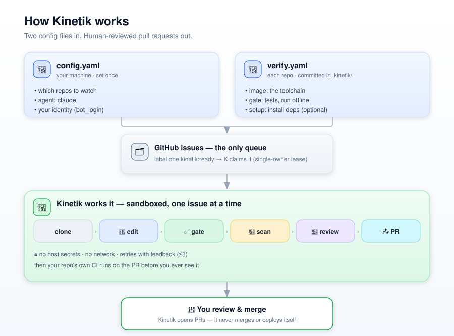

# Kinetik

Kinetik is a persistent orchestrator you run on your own machine: it polls human-curated GitHub
issues, claims one via an epoch-leased append-only claim log so no other instance double-works it,
runs a real Claude coding agent whose *commands* are confined to a credential-free, no-network
sandbox, verifies the result with a fast local gate plus the repo's existing CI, and opens a pull
request for you to merge when you get back from hugging trees.



Depth lives in the design docs: [`kinetik-spec.md`](docs/kinetik-spec.md) (the vision) and
[`kinetik-mvp.md`](docs/kinetik-mvp.md) (the as-built system).

## Prerequisites

- `gh` installed and logged in (`gh auth status`) — Kinetik makes all GitHub writes through it.
- Docker running — one ephemeral sandbox container per task.
- `claude` CLI installed and logged in (or `ANTHROPIC_API_KEY` set for headless servers).
- Python ≥ 3.9.

## Install

```bash
pip install -e '.[dev]'
```

## Config

Per machine, at `~/.kinetik/config.yaml` (not in a repo):

```yaml
instance_id: kinetik/uros@laptop   # stamped in every claim-log entry
bot_login:   uros                    # only this author's claim markers are trusted
agent:       claude                  # or: demo (dry-runs the pipeline). Required for `run`.
repos:
  - trco/kinetik                   # plain string = all defaults
  - repo:    trco/other-project      # or a mapping, for per-repo settings:
    plugins: [living-docs]           #   optional — universal K plugins on here (default: all)
    agent:   demo                    #   optional — overrides the machine-level `agent:` above
assignee:    uros                    # optional — personal queue; omit for the shared queue
lease_min:   60                      # optional
poll_sec:    300                     # optional
```

`plugins:` lists only the **universal, K-bundled** plugins (today: `living-docs`); `[]` turns them
all off. A repo's own `.claude/` is auto-loaded and needs no entry — and always wins per file.

## Per-repo recipe

Each target repo declares how it is verified, at `.kinetik/verify.yaml`:

```yaml
image: python:3.11-slim              # sandbox image with the toolchain
gate:  python -m pytest -q           # runs OFFLINE in the box; must pass before a PR opens
setup: pip install --target /work/.deps -r requirements.txt   # optional, runs WITH network first
network: none                        # optional; 'bridge' only if the agent itself needs the net
```

This file is the trust anchor — a human confirms it. `kinetik onboard` proposes one via a PR.

## Commands

```bash
kinetik init-labels --repo owner/name   # create the kinetik:* labels (run automatically by `run`)
kinetik onboard     --repo owner/name   # agent proposes .kinetik/verify.yaml via a PR
kinetik run                             # the daemon: poll -> claim -> execute -> open PR
kinetik status                          # read-only: what K owns / is working / has blocked
```

Label an issue `kinetik:ready` to queue it. `kinetik:hold` on an issue, or an open issue
labelled `kinetik:paused`, stops Kinetik on that issue or repo. `kinetik:plan-first` makes
Kinetik open a plan-only PR and wait: merge it to approve the plan, then set `kinetik:ready`
again and it implements against the merged plan. Without that label it plans and implements in one
PR (and skips the plan file entirely when the issue is trivial).
